# Zweiweg Varianzanalyse
## Allgemeines Modell
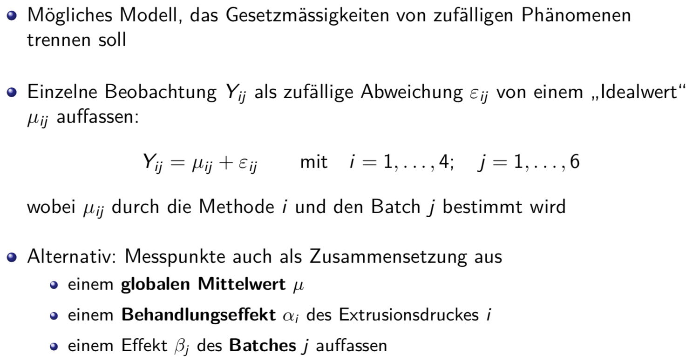
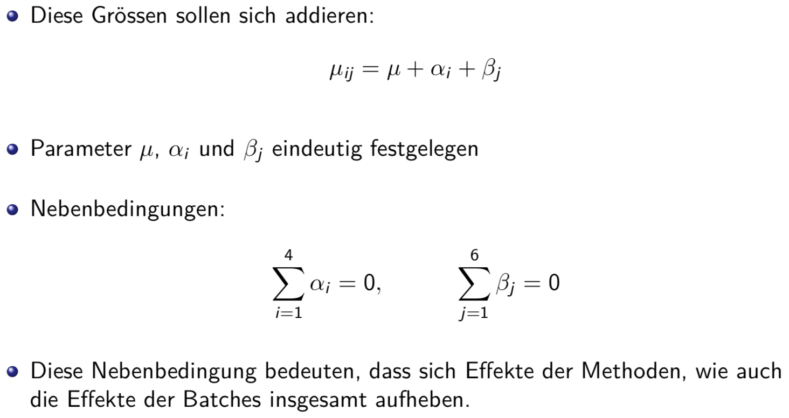

## Hypothesentest
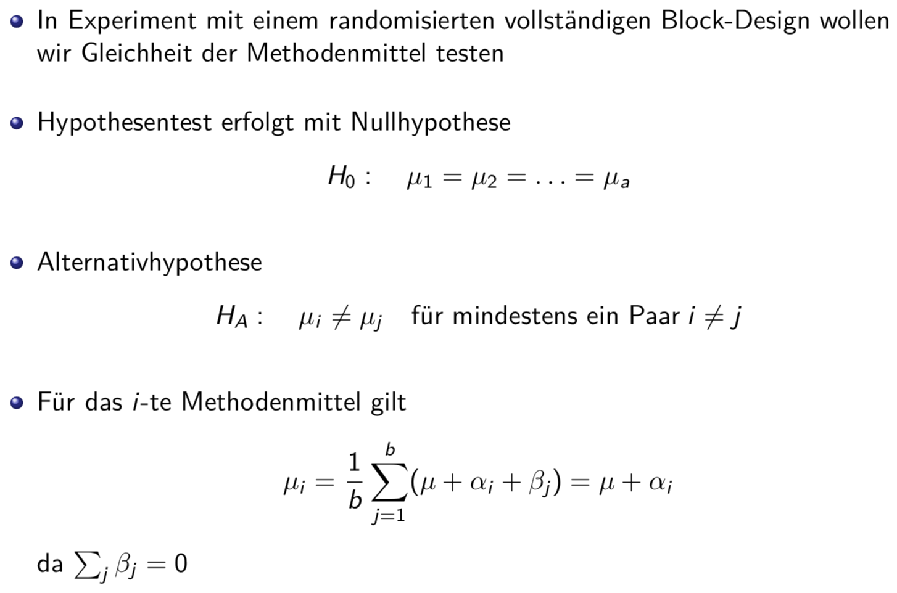
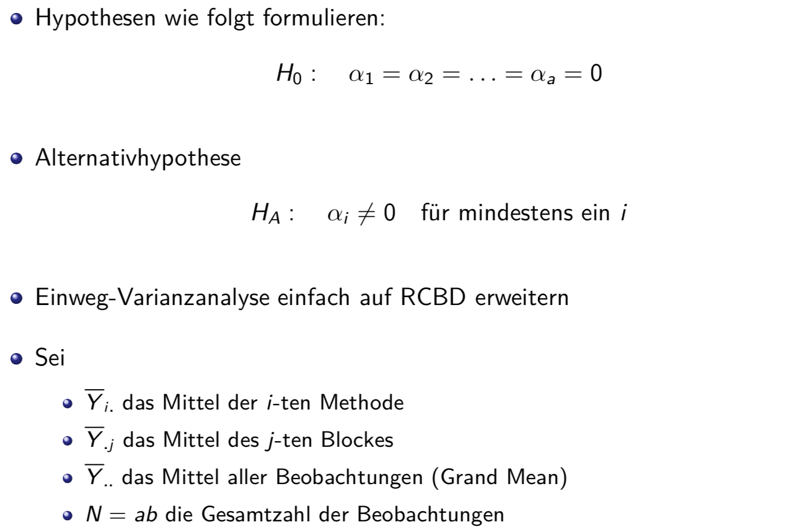
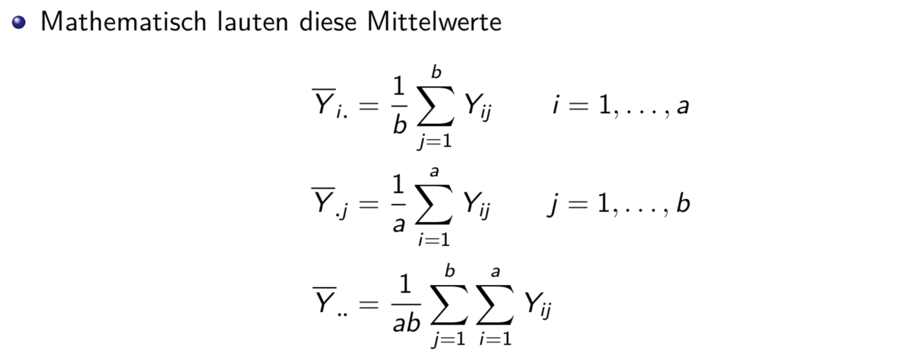

## Parameterschätzung
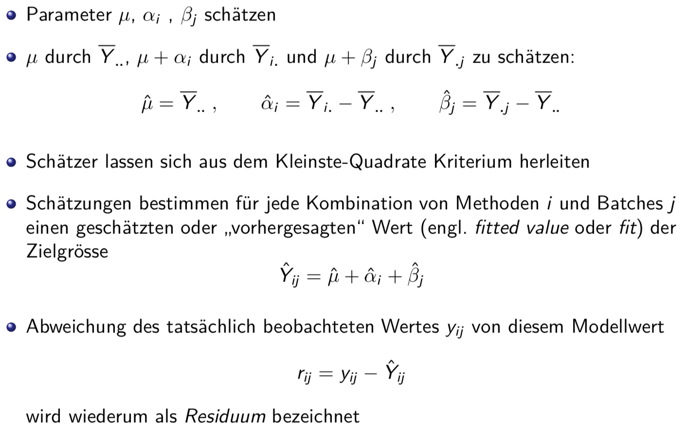

## Anova-Test
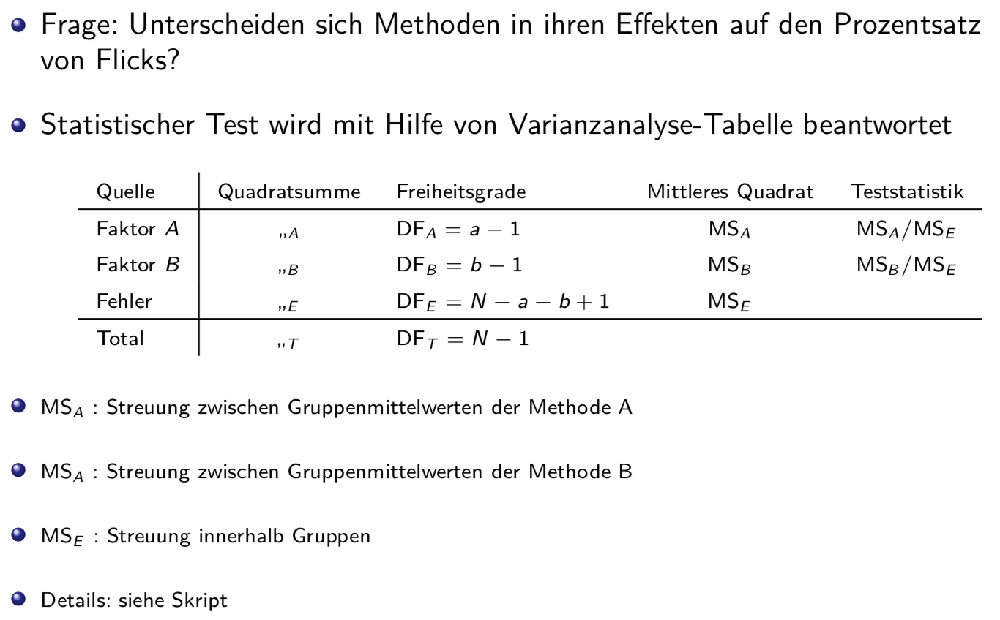

## Fraktorielle Experimente mit zwei Faktoren
* Sind bei einem Experiment mehrere Faktoren von Interesse, dann sollte ein faktorielles Experiment angewendet werden
* Dabei wird das Experiment mit Kombinationen der Stufen der betrachteten Faktoren durchgeführt
* Betrachten den einfachsten Fall eines faktoriellen Experiments, welches nur zwei Faktoren enthält

## Interaktion / Wechselwirkungen
* Wenn das additive Modell nicht gilt, sprechen wir allgemein von Wechselwirkungen oder Interaktionen
* Interpretation: i-te Stufe des Faktors A und die j-te Stufe des Faktors B nicht jede für sich wirken, sondern auch die Wirkung der andern beeinflussen

## Allgemein: Faktorielle Experimente mit zwei Faktoren
* Faktorielles Experiment enthalte zwei Faktoren: Faktor A hat a Stufen und entsprechend gibt es b Stufen für Faktor B
* Experiment hat n Wiederholungen oder Replikate
* Jede Wiederholung enthält alle a · b möglichen Stufenpaare
* Hier steht Yijk für die k-te Beobachtung bei Stufe i für Faktor A und bei Stufe j für Faktor B
* Tabelle:
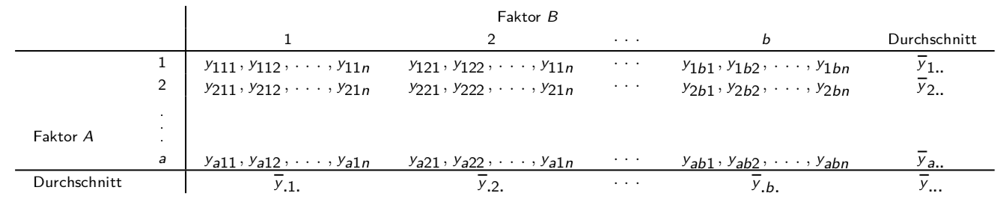

## Allgemein: Modell mit zwei Faktoren
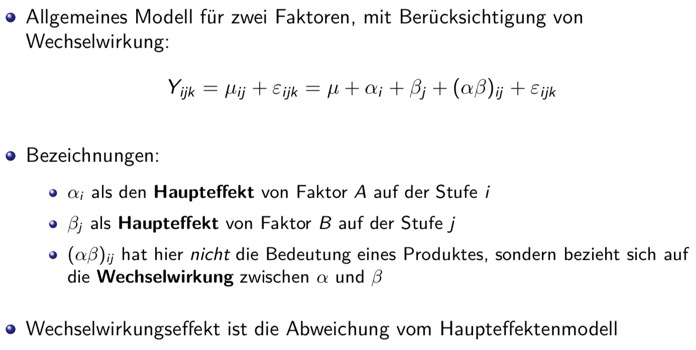
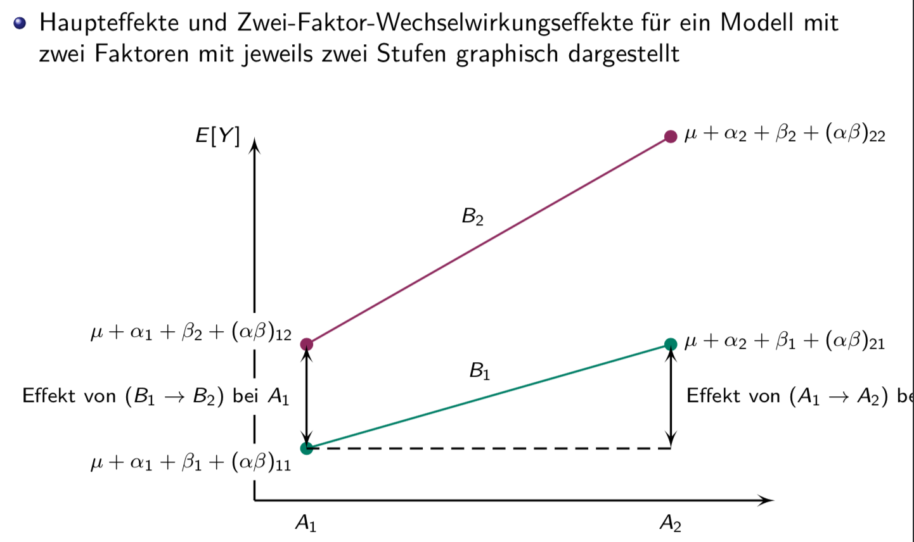
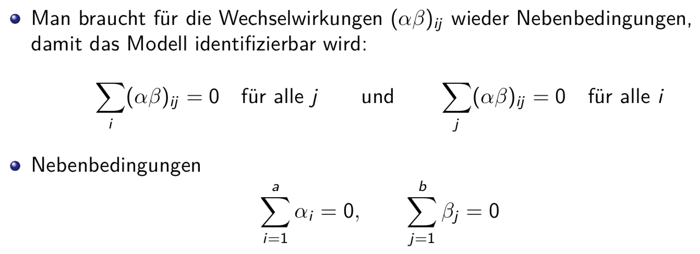

## Parameterschätzung
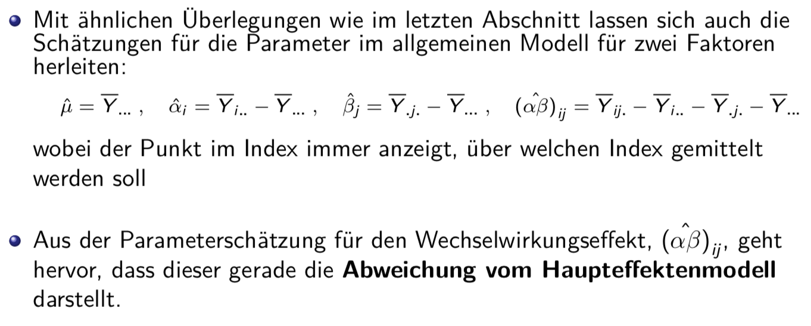
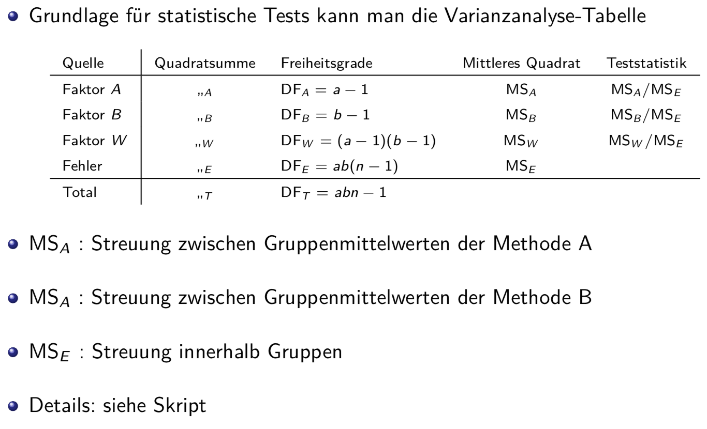