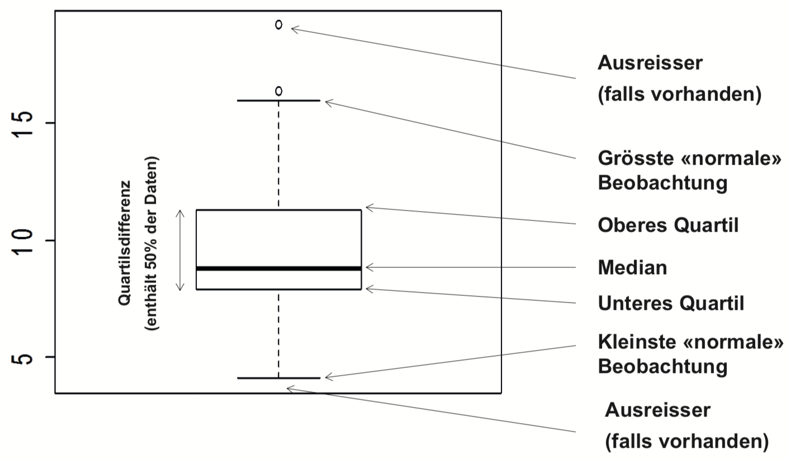
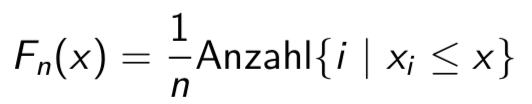

# Deskriptive Statistik 2

## Boxplot

* Grösste normale Beobachtung: 1.5 *                    Quartilsdifferenz vom oberen Quartil entfernt

* Kleinste normale Beobachtung: 1.5 *                   Quartilsdifferenz vom unteren Quartil entfernt

* Aussreiser: Ausserhalb dieses Bereichs

## Schiefe

## Empirische kumulative Verteilungsfunktion

