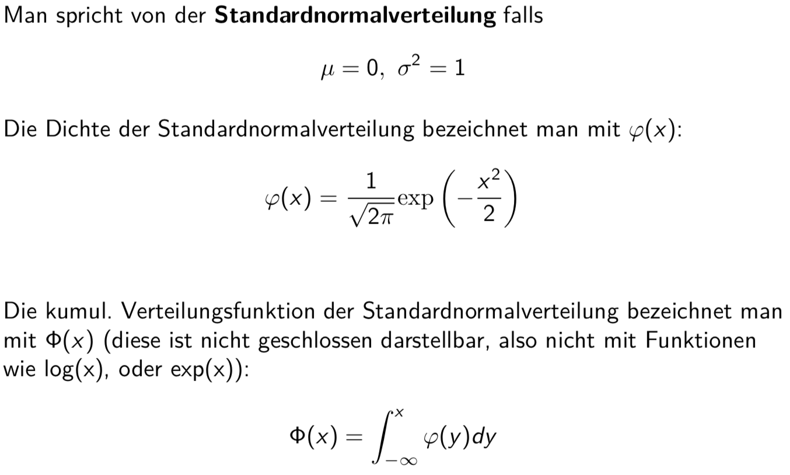

# Stetige Wahrscheinlichkeitsverteilungen

## Round Up SW01 & SW02
Möchte man den Zusammenhang zwischen Daten sehen, kann eine Regressionsgerade eingezeichnet werden.
Mittels Korrelationskoeffizient sieht man ob grundsätzlich ein Zusammenhang zwischen den Daten besteht.
Man sollte sich aber trotzdem die Daten Plotten um den Zusammenhang visuell zu sehen.

Quantile: 30% Quantile (30% kleiner als der Wert, 70% grösser als der Wert)

## Zufallsvariable

* Zufallsvariablen sind diskret, falls Zahlen, die X annehmen   kann, diskret sind
* Anzahlen sind stets diskret, also Elemente von N0

Beispiel:

Summieren:

## Wahrscheinlichkeitsverteilung

Beispiel:

Die Summe muss wiederum 1 ergeben!

## Wahrscheinlichkeitsdichte
Das Problem bei der Wahrscheinlichkeitsverteilung ist, dass es möglich ist das die Wahrscheinlichkeit für einen Wert gegen Null gehen kann weil zuviele Werte möglich sind. Deshalb muss die Wahrscheinlichkeit in einem gewissen Bereich angeschaut werden.

### Vergleich der Konzepte (diskret vs. stetig)

Diskret: Zum Beispiel Jasskarten
Stetig: Voltmeter (Messgerät)

### Erwartungswert und Varianz

Wenn kurve 'ausgeschnitten' dann ist der Erwartungswert beim Schwerpunkt der ausgeschnittenen Kurve.

### Quantile

### Uniforme Verteilung

## Exponentialverteilung

Wahrscheinlichkeit im Graph ablesen (y Wert ist die Wahrscheinlichkeit), dann den Schnittpunkt mit der Verteilungsfunktion suchen und somit x Wert bestimmen.

Beispiel Mathematisch:

## Normalverteilung (Gaussverteilung)

### Eigenschaften

### Standardnormalverteilung
