# z-Test, t-Verteilung, t-Test

## Momentmethode

[X] = 1/lamda = Mittelwert Xn
lamda = 1/Mittelwert Xn

Wobei Xn die Datenpunkte sind.

## Maximum - Likelihood - Methode
L(lambda) = Produkt i=1 bis n f(xi ; lambda)

f -> Wahrscheinlichkeitsfunktion

Ergebnis sollte gleich sein wie bei der Momentmethode
(lambda = 1 / Mittelwert Xn)

## P-Wert
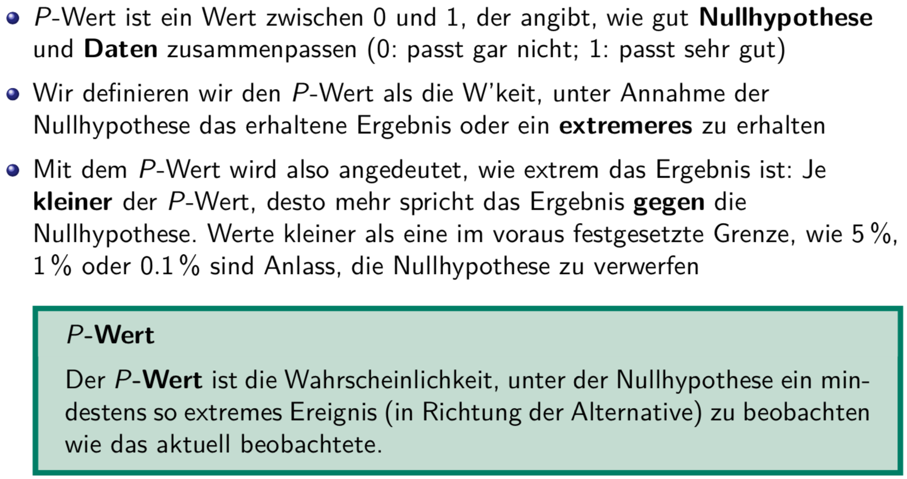

### Beispiel: Statistischer Test für Durchschnittsgrösse
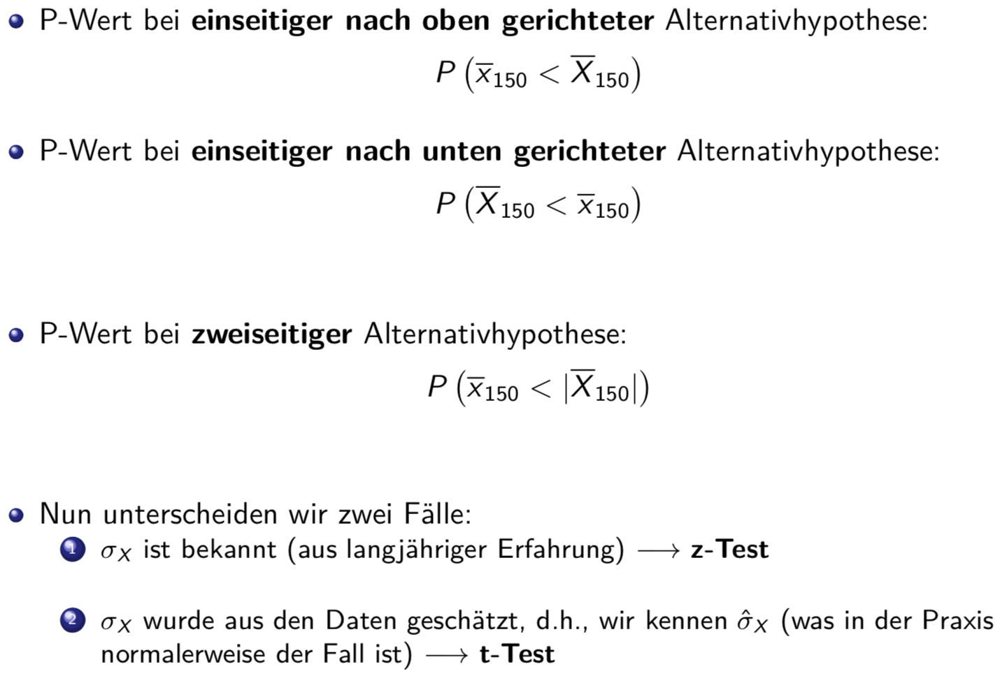

### Beispiel: z-Test
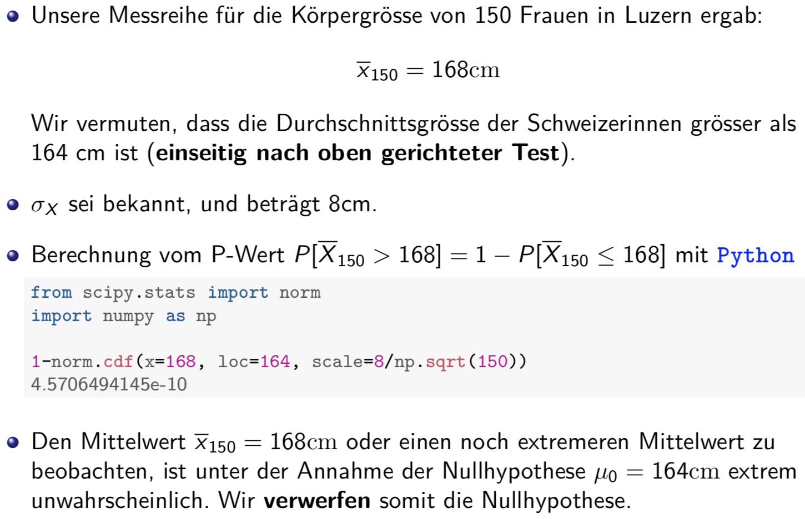

### P-Wert, Testentscheid
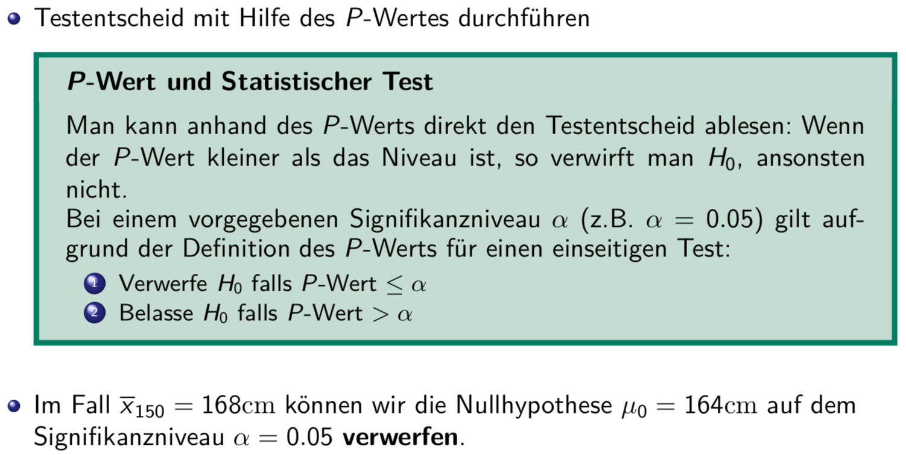

## z-Test
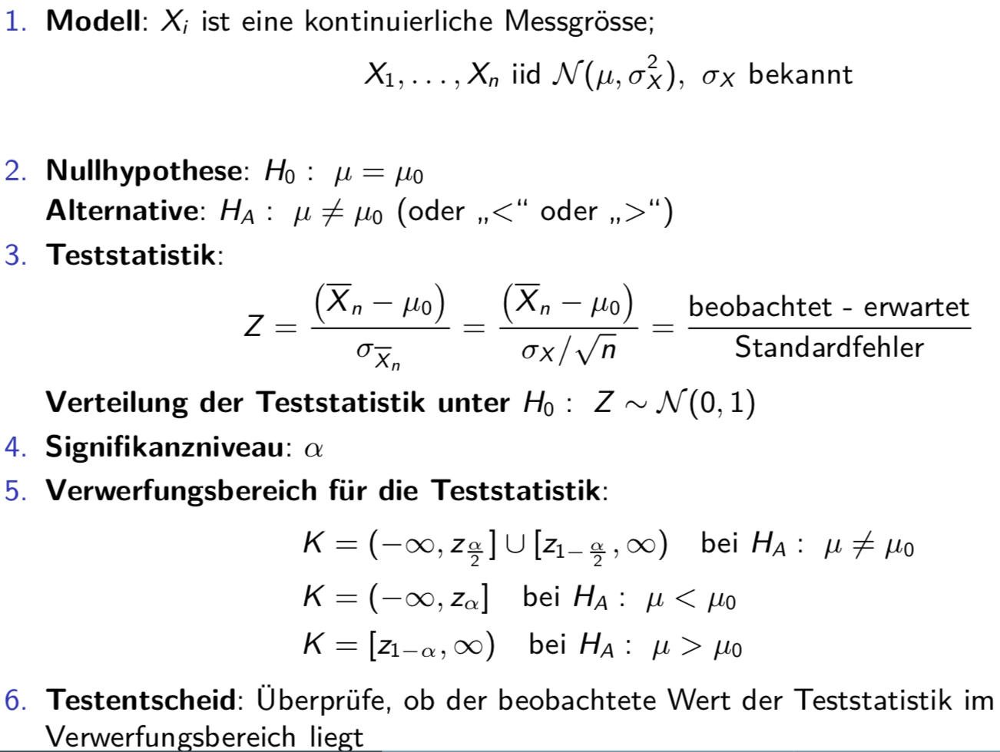

### Zweiseitiger Verwerfungsbereich beim Z-Test
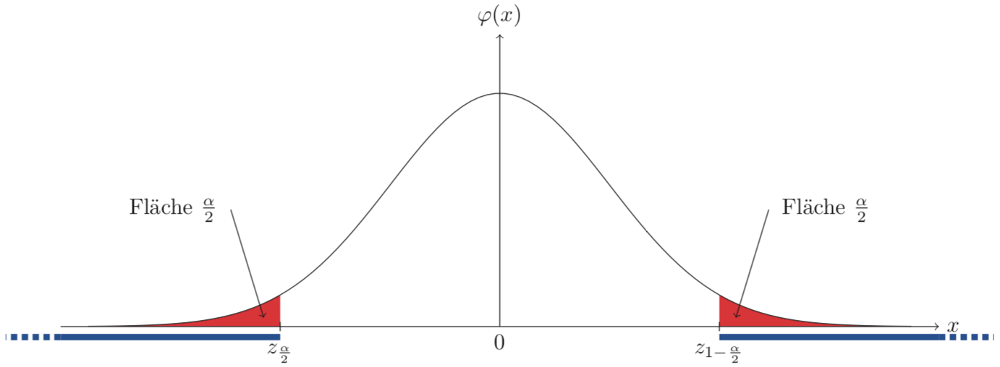
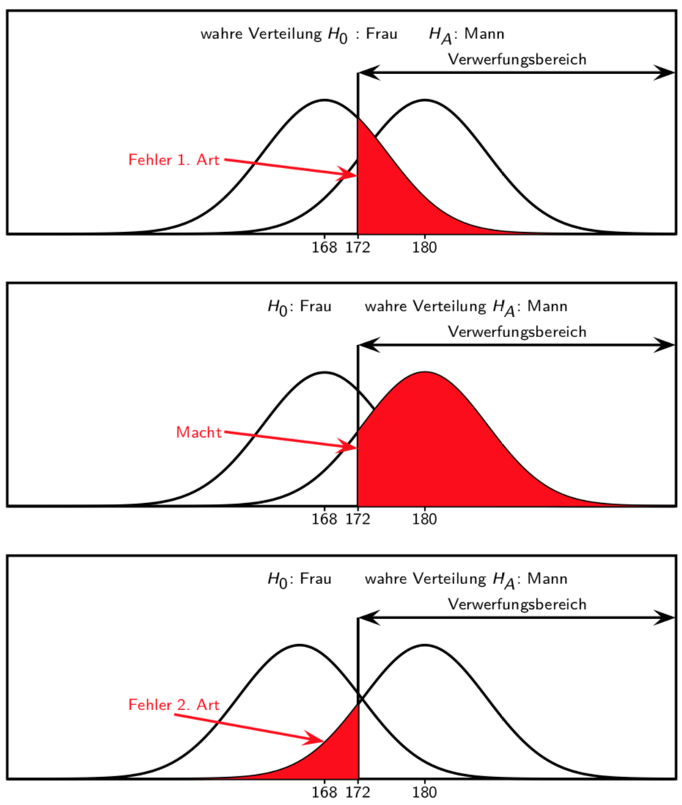

### Problem in Praxis: ox ist unbekannt
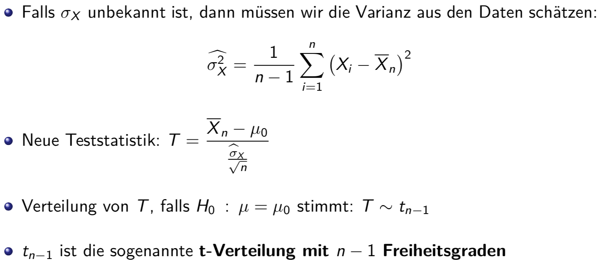

## Student's t-Verteilung
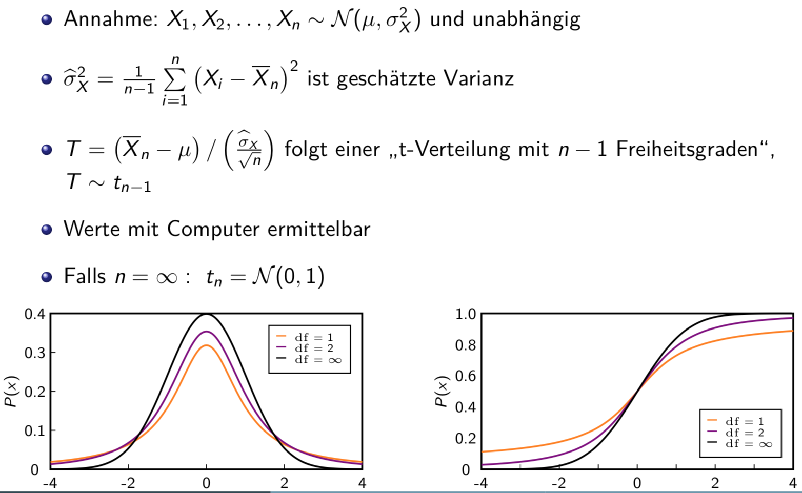

### Eigenschaften
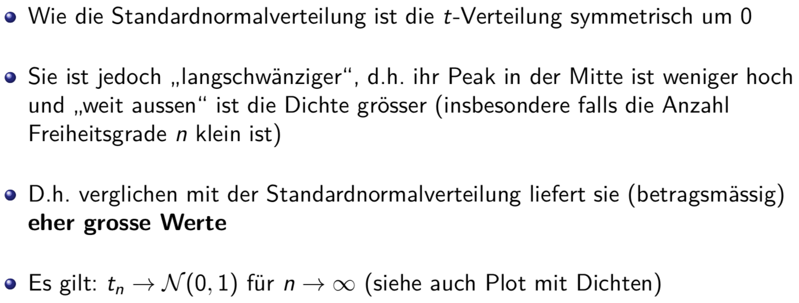

### t-Verteilung: Dichten
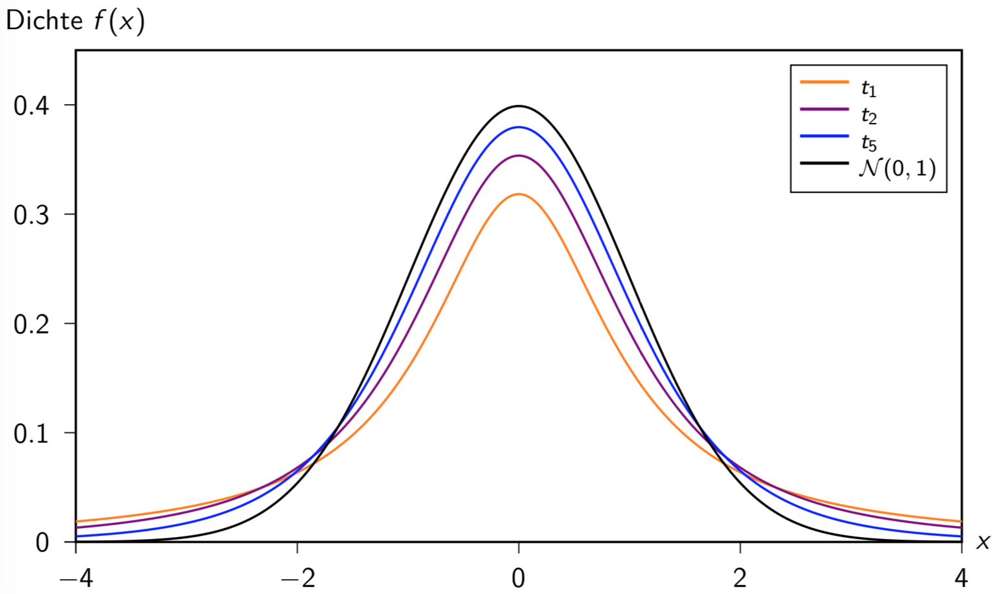

## t-Test: ox unbekannt
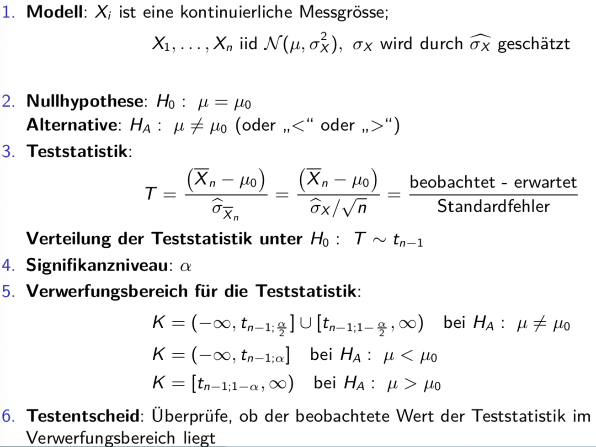

### t-Test
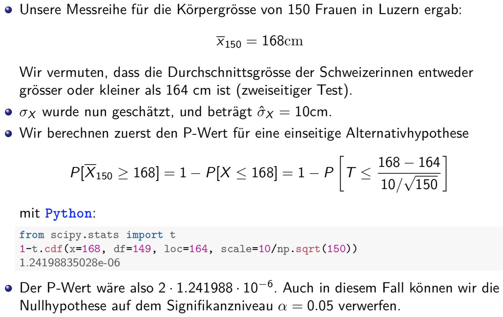
