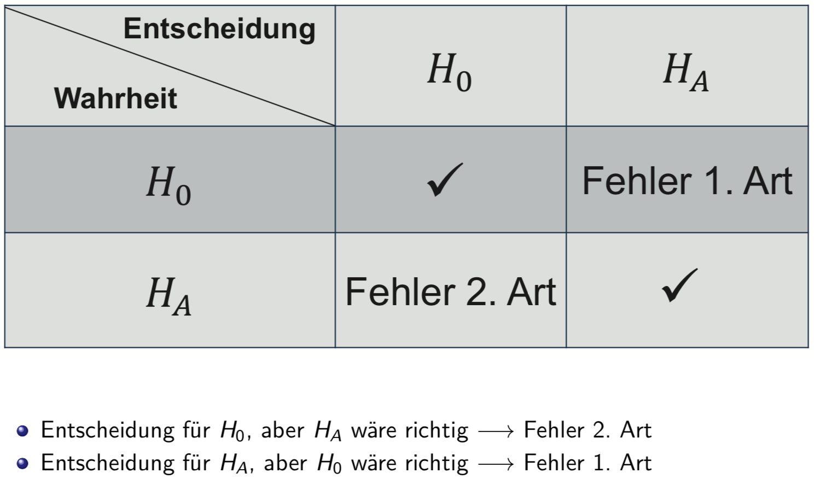
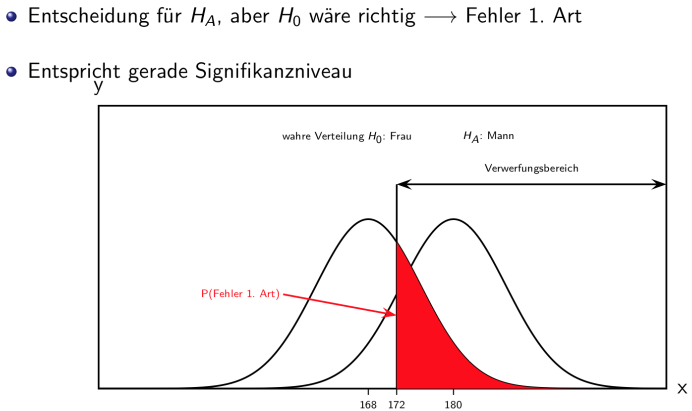
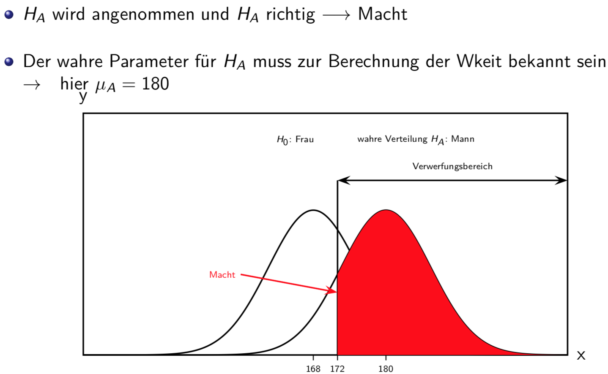
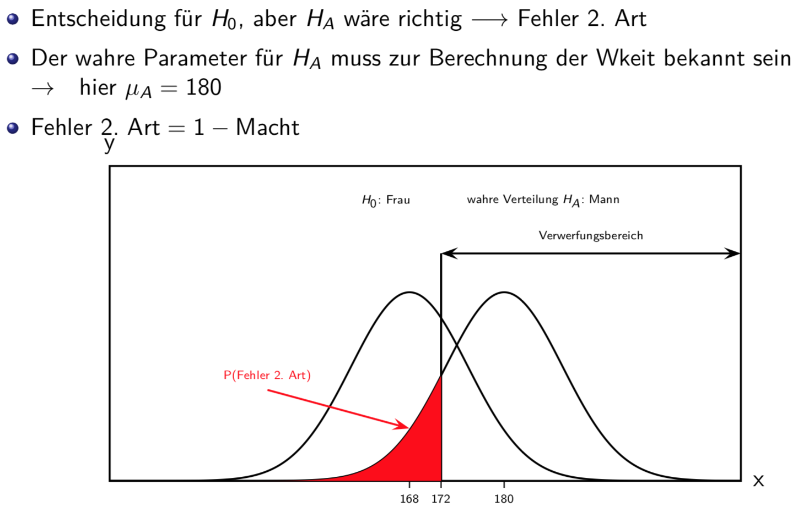

# Fehler 1. und 2. Art, Vertrauensintervall

## Fehler 1. und 2. Art beim Hypothesentest

### Fehler 1. Art

### Macht

### Fehler 2. Art

### Welche Fehlerart ist wichtiger?
* Fehler 1. Art hat traditionell mehr Gewicht als Fehler 2. Art
* Wissenschaftler arbeiten genau und haben Angst, einen Humbug zu publizieren, der sich dann als falsch herausstellt
* Denn wenn Wissenschaftler einen Effekt (signifikante Abweichung von Nullhypothese) beobachten, möchten sie sicher sein, dass es sich nicht bloss um Zufall handelt
* Fehler 1. Art soll vermieden werden
* Man nimmt in Kauf, dass man manchmal wichtigen Effekt verpasst

### Fehler 1. Art / 2. Art
* Fehler 1. Art wird direkt kontrolliert durch Konstruktion eines Tests, indem Signifikanzniveau α möglichst klein gehalten wird
* Über die W’keit eines Fehlers 2. Art hat man keine solche Kontrolle
* Die beiden Fehlerarten konkurrenzieren sich gegenseitig: P(Fehler 2. Art) wird grösser falls α kleiner gewählt wird
* Wahl von α steuert Kompromiss zwischen Fehler 1. und 2. Art
* Weil man aber primär einen Fehler 1. Art vermeiden will, wählt man α klein, z.B. α = 0.05
* Je kleiner α, desto kleiner der Verwerfungsbereich
* Vertikale Linie wandert nach rechts → Fehler 2. Art wird umso grösser