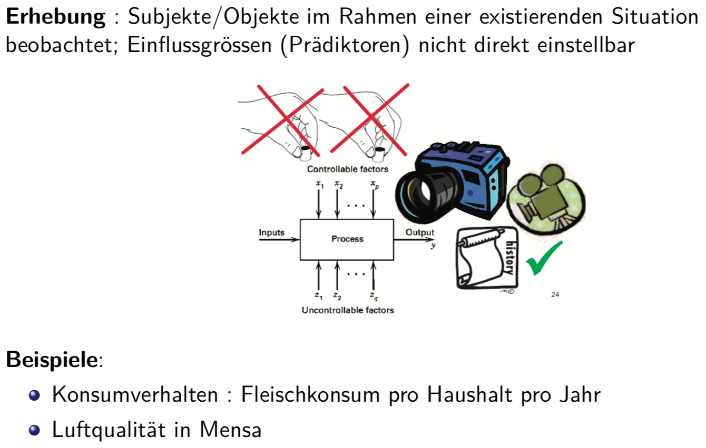
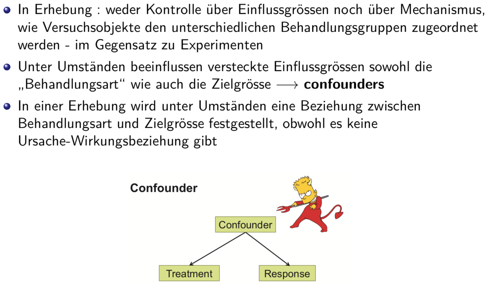

# Versuchsplanung

## Experiment

## Erhebung

### Verschiedene Sorten von Erhebungen

## Prospektive Kohortenstudie versus Retrospektive Fall-Kontroll-Studie

## Ursache-Wirkung Beziehung

## Kausalität und Erhebungen

## Ziele der statistischen Versuchsplanung (DoE)

## Grundelemente der Versuchsplanung - Beispiel Polio

### Versuchsplan - Beispiel Polio

### Kontrollgruppe - Beispiel Polio

### Randomisierte Doppelblind-Studie: Beispiel Polio

## Grundelemente der Versuchsplanung

## Versuchspläne

## Übersicht Versuchspläne

## Vollständig randomisierter Versuchsplan: Beispiel Meat

