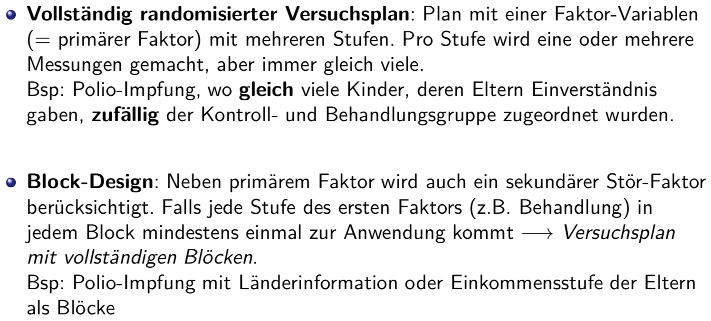
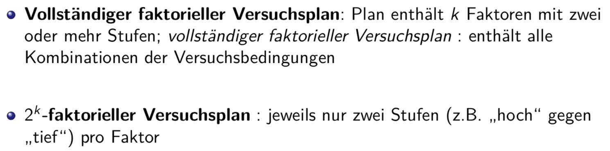
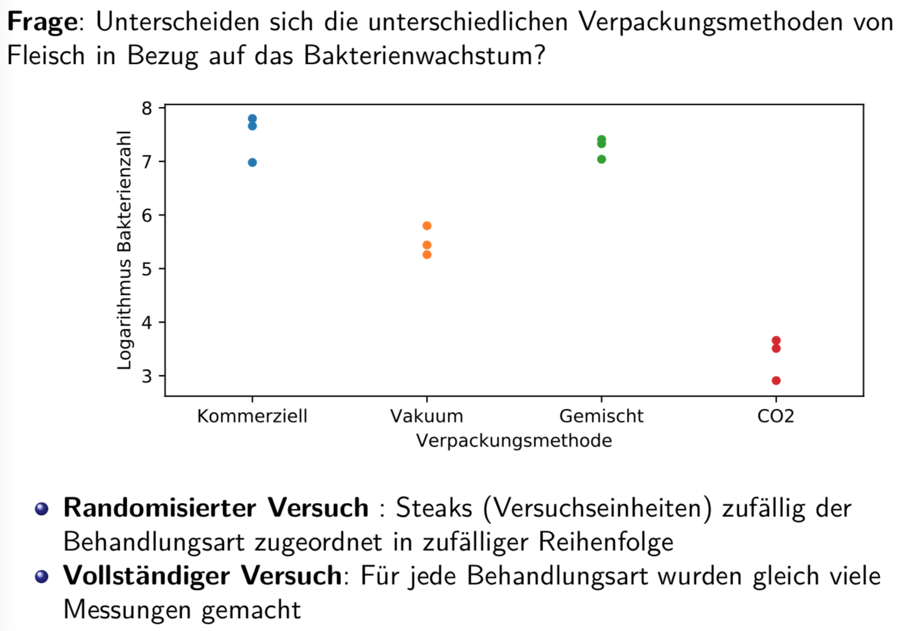

# Einfache Varianzanalyse

## Übersicht Versuchspläne

## Vollständig randomisierter Versuchsplan: Beispiel Meat

* Studie: Wirksamkeit der Verpackungsart auf Bakterienwachstum von gelagertem Fleisch untersuchen. Vier Verpackungsarten ("Behandlungsarten") wurden untersucht:
    * Kommerzielle Plastikverpackung (mit Umgebungsluft)
    * Vakuumverpackung
    * 1% CO, 40% O2, 59% N
    * 100% CO2

* Versuchseinheiten: 12 Rindssteaks (ca. 75g)

* Zielgrösse: Logarithmus der Anzahl Bakterien pro Quadratzentimeter (Anzahl Bakterien neun Tage nach der Verpackung und Lagerung bei 4 Grad Celsius gemessen)

### Vergleich von Gruppenmittel mit g > 2: Beispiel Meat
