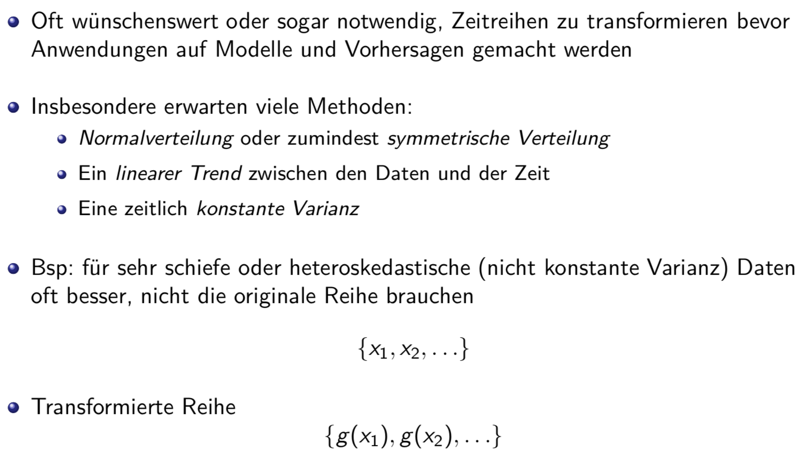

# Zeitreihen

## Beispiel Passagierdaten


## Aktienkurs von Tesla


## Zeitreihen mit Pandas
```python
import matplotlib.pyplot as plt
import numpy as np
import pandas as pd

AirP = pd.read_csv("*AirPassengers.csv") AirP.head()
AirP["TravelDate"] = pd.DatetimeIndex(AirP["TravelDate"]) AirP.set_index("TravelDate", inplace=True)
AirP.head()
AirP.plot()
plt.xlabel("Reisedatum") plt.ylabel("Anzahl Passagiere (in 1000)")
```

### Step by Step
* Lesen der Datei
* Überprüfen mit .head() ob richtig
    ```python
    AirP = pd.read_csv("...AirPassengers.csv") AirP.head()
    ##      TravelDate  Passengers
    ## 0    1/1/1949    112
    ## 1    2/1/1949    118
    ## 2    3/1/1949    132
    ## 3    4/1/1949    129
    ## 4    5/1/1949    121
    ```
* Spalte links ist der Index
* Daten sollen Index sein
* Spalte TravelDate muss zuerst in ein Datumformat umgeformt werden, welches pandas versteht
* Die geschieht mit dem Befehl DatetimeIndex
    ```python
    AirP["TravelDate"] = pd.DatetimeIndex(AirP["TravelDate"])
    ```
* Daten noch als Index (Bezeichnung der Zeilen) übernehmen:
    ```python
    AirP.set_index("TravelDate", inplace=True)
    ```
* Der Anfang der Tabelle sieht dann so aus:
    ```python
    AirP.head()
    ## Passengers ## TravelDate
    ## 1949-01-01 112
    ## 1949-02-01 118
    ## 1949-03-01 132
    ## 1949-04-01 129
    ## 1949-05-01 121
    ```
* Plotten
    ```python
    AirP.plot()
    plt.xlabel("Reisedatum") plt.ylabel("Anzahl Passagiere (in 1000)")
    plt.show()
    ````
* Auswählen zwischen Datum
    ```python
    AirP.loc["1949-01-01":"1949-05-01",:].plot()
    ```

## Multivariante Zeitreihen
* Vierteljährlicher Stromverbrauch (in Millionen kWh) in Australien mit vierteljährlicher Bierproduktion vergleichen

```python
import matplotlib.pyplot as plt
import numpy as np
import pandas as pd
AusBeer = pd.read_csv("*AustralianBeer.csv",sep=";",header=0) AusEl = pd.read_csv("*AustralianElectricity.csv",sep=";")
Aussie = AusBeer.copy()
# Hier wird der Datensatz um eine Spalte erweitert
Aussie["kilowatt"] = AusEl["kilowatt"] Aussie["Quarter"]=pd.DatetimeIndex(Aussie["Quarter"])
Aussie.set_index("Quarter", inplace=True) Aussie.plot(subplots=True)
plt.show()
```



## Box-Cox-Transformationen


### Code
```python
def boxcox(x,lambd):
return np.log(x) if (lambd==0) else (x**lambd-1)/lambd
AirP["l_2"] = boxcox(AirP["Passengers"],2) AirP["l_0"] = boxcox(AirP["Passengers"],0) AirP["l_-05"] = boxcox(AirP["Passengers"],-.5)
plt.subplot(221) AirP["Passengers"].plot() plt.title("Original") plt.xlabel("")
plt.subplot(222) AirP["l_-05"].plot() plt.title("lambda=-0.5") plt.xlabel("")
plt.subplot(223) AirP["l_2"].plot() plt.title("lambda=2") plt.xlabel("")
plt.subplot(224) AirP["l_0"].plot() plt.title("lambda=0") plt.xlabel("")
plt.show()
```

## Zeitachsentrasnformation


### Beispiel AirPassengers
* shift-Funktion von pandas
```python
AirP["s_4"] = AirP["Passengers"].shift(4)
AirP["s_-5"] = AirP["Passengers"].shift(-5)
AirP["Passengers"].plot()
AirP["s_4"].plot()
AirP["s_-5"].plot() plt.legend(["Original","zurueckverschoben","vorverschoben"])
plt.show()
```

## Log-Returns


## Visualisierungen


## Zerlegung von Zeitreihen


## Bewegendes Mittel (moving average)


